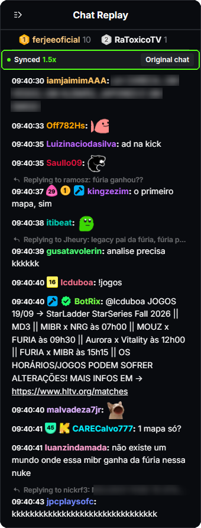

# VOD Chat Sync for Kick

Chrome extension that keeps **Kick's VOD chat replay in sync with the video** at any playback speed (1.25x, 1.5x, 2x), with pause and seek.

<sub>🇧🇷 [Português](README.pt-BR.md)</sub>

<p align="center">
  
</p>

## The problem

Kick's VOD chat replay shows messages at wall-clock pace. If you watch at **1.5x** or **2x**, the video runs ahead of the chat and reactions show up after the moment they're about.

## How it works

- Reads the video's current time (`currentTime`) and converts it to the stream's real time.
- Fetches messages from the same API the Kick website uses, a little ahead of the video.
- Shows each message **when the video reaches it**. That's why it works at any speed, pauses with the video and catches up when you skip to another point.

The panel takes the place of Kick's message list and follows the native chat's look: VOD timestamp, badges (level, subscriber, moderator, VIP, founder…), emotes, replies, links and the font size you set in the chat.

## Install

Submitted to the Chrome Web Store and under review. Until it's approved, install it manually:

1. From the [latest release](https://github.com/matBentes/kick-vod-chat-sync/releases/latest), download **Source code (zip)** and unzip it somewhere you won't delete (or `git clone`).
2. Open `chrome://extensions` and turn on **Developer mode**.
3. Click **Load unpacked** and pick the **`extension/`** folder from what you downloaded.
4. Open any VOD (`kick.com/<channel>/videos/<id>`) and change the speed in the player.

Works in Chrome and Chromium-based browsers (Edge, Brave, Opera). Not tested on Firefox.

## Controls

Nothing to configure: the chat stays in sync all the time. The panel text follows Chrome's language (English or Portuguese). The top bar shows the state:

| Control | What it does |
| --- | --- |
| **Synced 1.5x** | Extension chat is active; the speed only shows when it isn't 1x |
| **Original chat** | Shows Kick's original replay. The bar stays on top with **Back to synced** |
| **New messages ↓** | Shows up if you scroll up; the chat doesn't pull you down while you read |

The extension never pauses, hides or realigns Kick's replay: it keeps running under the panel, the way Kick does it. When you switch to **Original chat** you see its real state, including the lag it builds up at 1.5x/2x.

## Limitations

- Uses Kick's internal endpoints (`web.kick.com/api/v1/...`), which aren't documented. If Kick changes them it may stop working; the panel then shows the error.
- The moderator, VIP, founder, OG and sub gifter icons are original drawings in Kick's colors. Level, subscriber and global badges use the official images the API already sends.
- Not an official project and not affiliated with Kick.

## Privacy

No data is collected. Requests go straight from your browser to Kick, like the ones the site makes. See [PRIVACY.md](PRIVACY.md).

## Project layout

```
extension/
  manifest.json   Manifest V3
  content.js      message fetching + sync with the video
  badges.js       channel badge icons
  styles.css      look (measurements taken from the native chat)
  _locales/       store name and description (en, pt_BR)
  icons/
docs/             images for this README
store/            Chrome Web Store listing text and images
```

No build step: what's in `extension/` is what runs.

## Support

The extension is free and will stay free. If it helped you, you can buy me a coffee:

[](https://ko-fi.com/matbentes)

## License

[MIT](LICENSE) © 2026 Mateus Bentes
