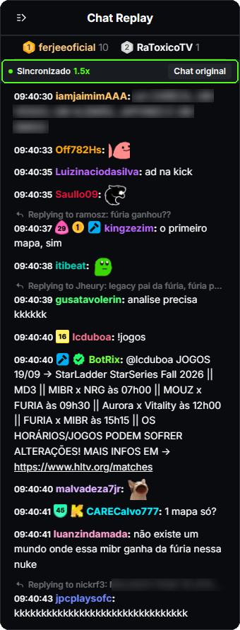

# VOD Chat Sync for Kick

Extensão para Chrome que deixa o **chat das VODs da Kick no mesmo ritmo do vídeo**, em 1.25x, 1.5x, 2x, com pause e seek.

<sub>🇺🇸 [English](README.md)</sub>

[](https://chromewebstore.google.com/detail/vod-chat-sync-for-kick/deeikanpfgojedfhhooelogofoeafkhg)

<p align="center">
  
</p>

## O problema

No replay de chat das VODs da Kick, as mensagens aparecem no ritmo do relógio. Se você assiste em **1.5x** ou **2x**, o vídeo anda mais rápido que o chat, e as reações chegam depois do lance que elas comentam.

## Como a extensão resolve

- Lê o tempo atual do vídeo (`currentTime`) e converte para o horário real da live.
- Busca as mensagens na mesma API que o site da Kick usa, um pouco à frente do vídeo.
- Mostra cada mensagem **quando o vídeo chega nela**. Por isso funciona em qualquer velocidade, pausa junto e se reposiciona quando você pula para outro ponto.

O painel ocupa o lugar da lista de mensagens da Kick e segue o visual do chat nativo: horário da VOD, badges (nível, assinante, moderador, VIP, founder…), emotes, respostas, links e o tamanho de fonte que você configurou no chat.


## Instalação

[](https://chromewebstore.google.com/detail/vod-chat-sync-for-kick/deeikanpfgojedfhhooelogofoeafkhg)

Instale pela **[Chrome Web Store](https://chromewebstore.google.com/detail/vod-chat-sync-for-kick/deeikanpfgojedfhhooelogofoeafkhg)**, abra qualquer VOD (`kick.com/<canal>/videos/<id>`) e ajuste a velocidade no player.

<details>
<summary>Instalação manual (pelo código)</summary>

1. Na [última release](https://github.com/matBentes/kick-vod-chat-sync/releases/latest), baixe **Source code (zip)** e descompacte numa pasta que você não vá apagar (ou faça `git clone`).
2. Abra `chrome://extensions` e ative o **Modo do desenvolvedor**.
3. Clique em **Carregar sem compactação** e escolha a pasta **`extension/`**.
</details>

Funciona no Chrome e em navegadores baseados nele (Edge, Brave, Opera). No Firefox não foi testada.

## Controles

Não tem nada para configurar: o chat fica sincronizado o tempo todo. Os textos do painel seguem o idioma do Chrome (português ou inglês). A barra no topo mostra o estado:

| Controle | O que faz |
| --- | --- |
| **Sincronizado 1.5x** | Chat da extensão ativo; a velocidade só aparece fora de 1x |
| **Chat original** | Mostra o replay original da Kick. A barra continua no topo com **Voltar ao sincronizado** |
| **Novas mensagens ↓** | Aparece se você rolar para cima; o chat não te puxa para baixo enquanto você lê |

O replay da Kick nunca é pausado, escondido ou realinhado pela extensão: ele continua rodando por baixo do painel, do jeito que a Kick faz. Ao trocar para **Chat original**, você vê o estado real dele, inclusive o atraso que ele acumula em 1.5x/2x.

## Limitações

- Usa rotas internas da Kick (`web.kick.com/api/v1/...`), que não são documentadas. Se a Kick mudar, pode parar de funcionar; nesse caso o painel mostra o erro.
- Os ícones de moderador, VIP, founder, OG e sub gifter são desenhos próprios nas cores da Kick. Badges de nível, de assinante e globais usam as imagens oficiais que a API já envia.
- Não é um projeto oficial nem afiliado à Kick.

## Estrutura

```
extension/
  manifest.json   Manifest V3
  content.js      busca das mensagens + sincronização com o vídeo
  badges.js       ícones dos badges de canal
  styles.css      visual (medidas tiradas do chat nativo)
  _locales/       nome e descrição na loja (en, pt_BR)
  icons/
docs/             imagens deste README
store/            textos e imagens da ficha na Chrome Web Store
PRIVACY.md        política de privacidade (nenhum dado é coletado)
```

Não tem etapa de build: o que está em `extension/` é o que roda.

## Apoie

A extensão é gratuita e continua sendo. Se ela te ajudou, dá para mandar um café:

[](https://ko-fi.com/matbentes)

## Licença

[MIT](LICENSE) © 2026 Mateus Bentes
